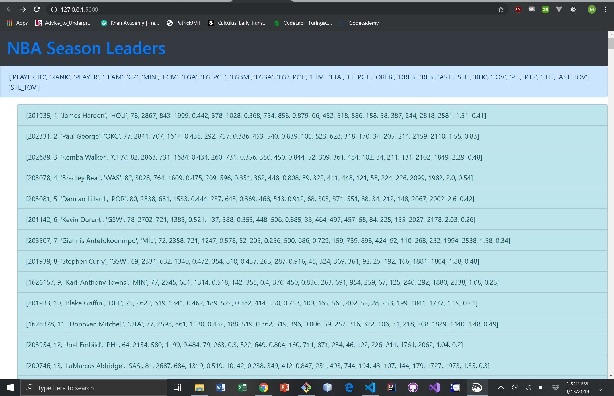

# API Client Using Python - NBA Season Leaders

This will get a JSON object from the NBA statistics website endpoint and will display the season leaders.

## Getting Started

- Python 3 is required

## To Run the Client
 
`pip install flask`

### You can either do A or B

- A)

`export FLASK_APP=app.py` //on windows it's set instead of export

`flask run`

- B)

`python app.py`

## Screenshot of it working

## JSON Data

['PLAYER_ID', 'RANK', 'PLAYER', 'TEAM', 'GP', 'MIN', 'FGM', 'FGA', 'FG_PCT', 'FG3M', 'FG3A', 'FG3_PCT', 'FTM', 'FTA', 'FT_PCT', 'OREB', 'DREB', 'REB', 'AST', 'STL', 'BLK', 'TOV', 'PF', 'PTS', 'EFF', 'AST_TOV', 'STL_TOV']

- 'PLAYER ID': The unique ID of a given player
- 'RANK': The ranking league-wide according to a metric
- 'PLAYER': A player's name
- 'TEAM': Team player plays for
- 'GP': Amount of games played
- 'MIN': Minutes played
- 'FGM': Amount of field goals made
- 'FGA': Amount of field goals attempted
- 'FG_PCT': FGM/FGA
- 'FG3M': Amount of three pointers made
- 'FG3A': Amount of three pointers attempted
- 'FG3_PCT': FG3M/FG3A
- 'FTM': Free throws made
- 'FTA': Free throws attempted
- 'FT_PCT': FTM/FTA
- 'OREB': Offensive rebounds
- 'DREB': Defensive rebounds
- 'REB': Total rebounds (OREB + DREB)
- 'AST': Total Assists
- 'STL': Total Steals
- 'BLK': Total Blocks
- 'TOV': Total Turnovers
- 'PF': Total Personal Fouls
- 'PTS': Total Points
- 'EFF': Efficiency
- 'AST_TOV': Assist to Turnover ratio
- 'STL_TOV': Steal to Turnover ratio
